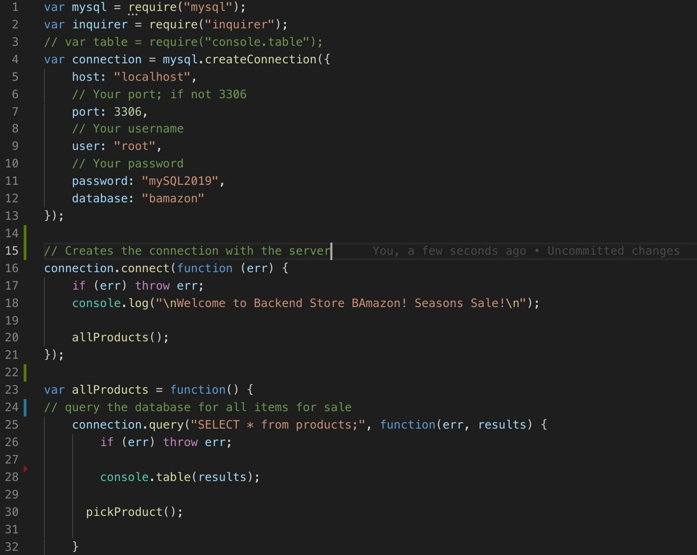
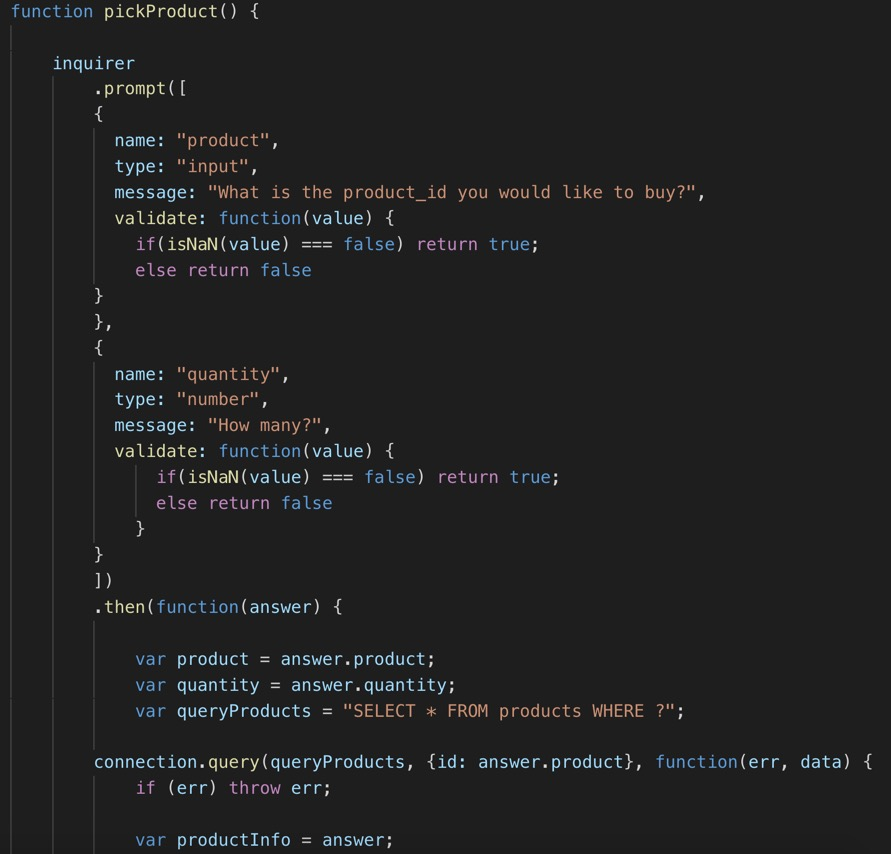
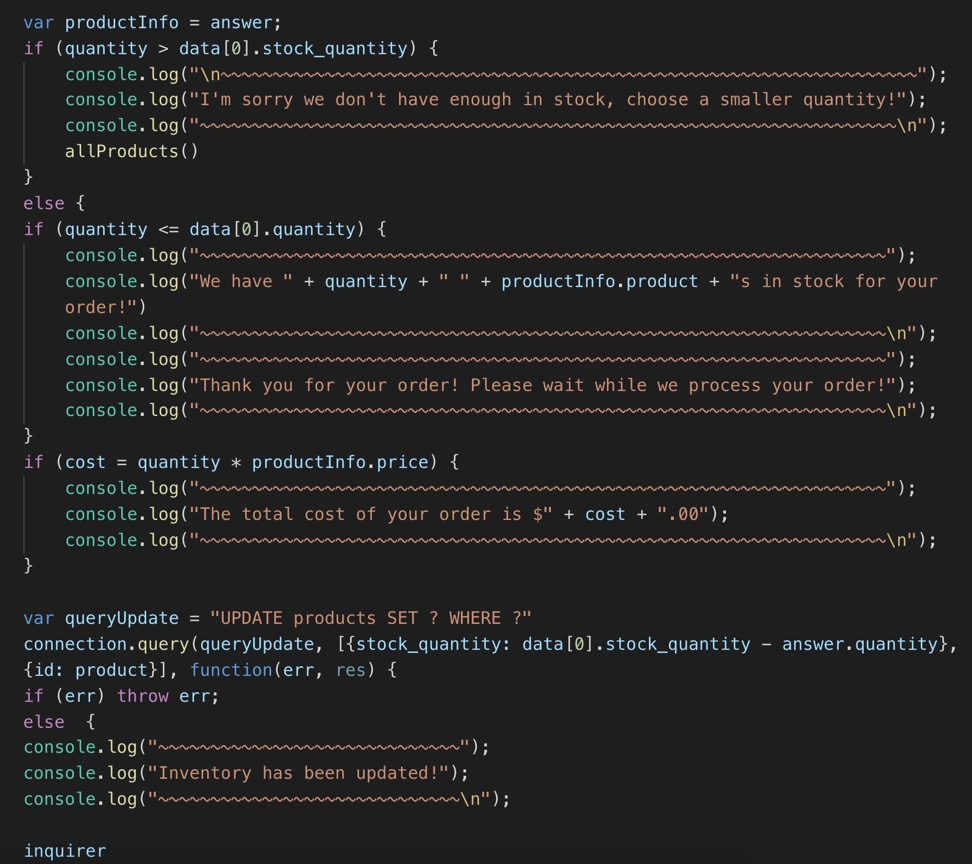

## Bamazon
A mock storefront with departments and products. Customers are able to use this app.

## Motivation
A Node app for customers to view items and place orders.

## Tech/framework used
<b>Built with</b>
- [Node.js](https://nodejs.org/en/)
- Javascript
- [MySQL](https://www.mysql.com/)
- [inquirer](https://www.npmjs.com/package/inquirer)
- [console.table](https://www.npmjs.com/package/console.table)

## Features
- Inquirer provides an easy to use UI with prompts asking the user what they would like to do. 
- Customers may purchase products from the available products in the database.  
- Console table organizes product, inventory, and department data in a concise manner within the CLI. 
- User input validation is present to ensure that customers cannot purchase more inventory than Bamazon has in stock.

## Installation
- Install [Node js](https://nodejs.org/en/)
- Clone the Bamazon repository to your machine
- Open CLI, navigate to the cloned repository, and run the following to install the npm package dependencies 

	npm install

- Open MySQL Workbench, SQL Pro, or your preferred database management app. Open the "bamazon.sql" script from the cloned repo, and run it to set up the database and base product/department data.

## How to use?
**Customers**
- Run the following in your CLI while inside your cloned repo directory

		node backendStoreCustomer.js

- Select from the resulting screen whether you would like to view items or leave.
- If you select view items, input and enter the item id that you would like to purchase
- Input and enter the quantity that you would like to buy
- If you would like to buy another item, repeat
- If you would like to leave, type No

## Screen Shots

## Author
Chet Budhathoki